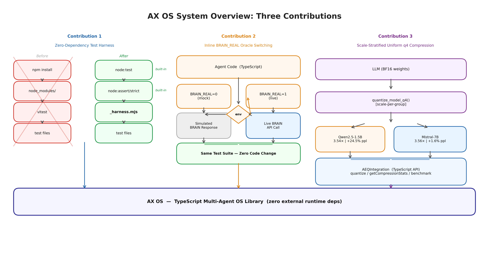
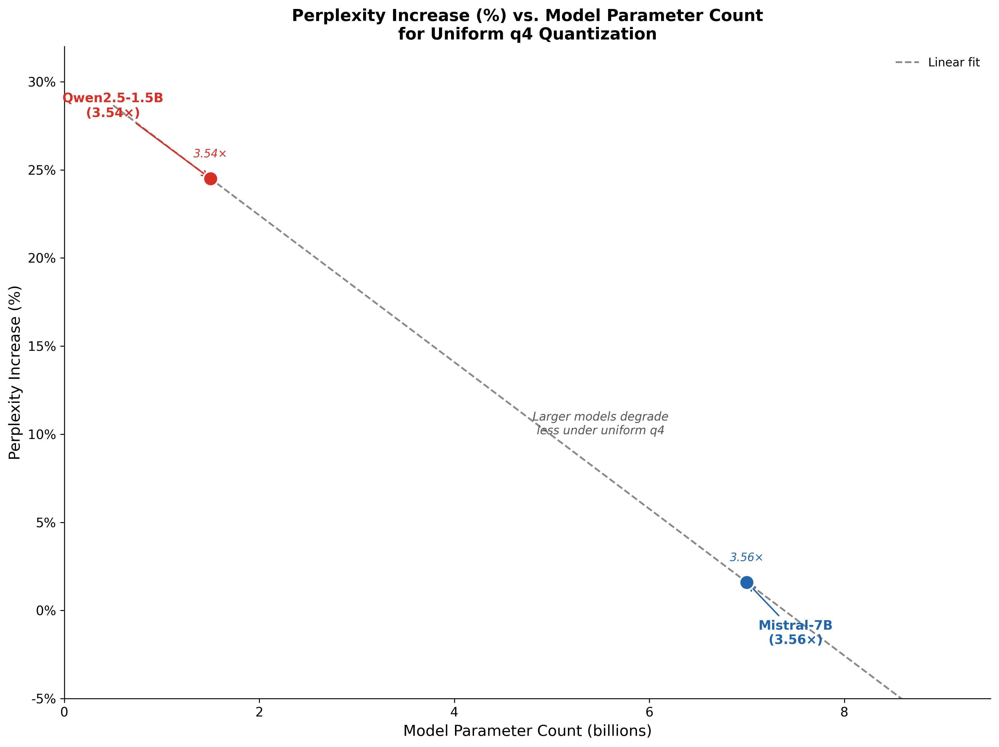
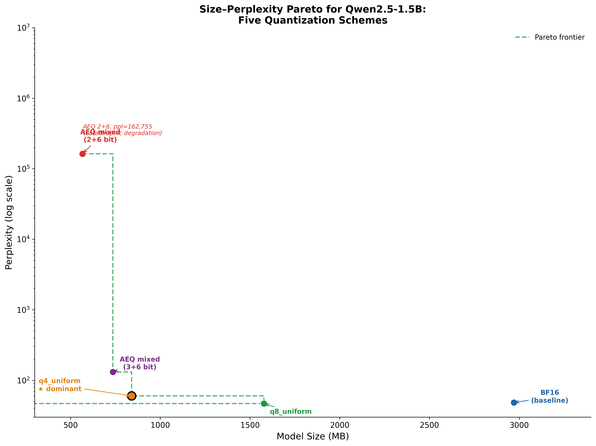
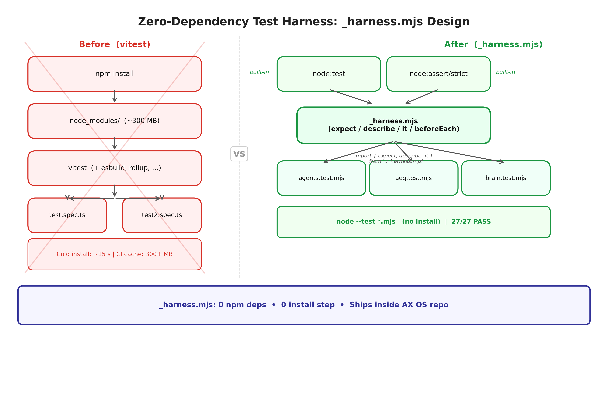

# AX OS

Hierarchical Adaptive Dimensionality Expansion (AX) Operating System for LLM reliability.

## Overview

AX OS is a reliability layer for LLM/agent systems that improves reliability and reduces cost without changing base model weights. It controls effective capacity through adaptive mechanisms.

## Architecture

```
┌─────────────────────────────────────────┐
│  Layer 4: Monitor (Telemetry, Alerts)  │
├─────────────────────────────────────────┤
│  Layer 3: Resilience Manager           │
│  (Rollback, Degradation, Recovery)     │
├─────────────────────────────────────────┤
│  Layer 2: Gate Manager                 │
│  (compute_g(), Routing Decisions)      │
├─────────────────────────────────────────┤
│  Layer 1: Capacity Controllers         │
│  (Top-K, Entropy)                      │
├─────────────────────────────────────────┤
│  Layer 0: Core Types & Interfaces      │
└─────────────────────────────────────────┘
```

## Installation

```bash
npm install
npm run build
```

## Usage

### Basic Usage

```typescript
import { createAXRuntime } from "./ax-os-index.js";

const ax = createAXRuntime("openai", {
  apiKey: process.env.OPENAI_API_KEY,
  model: "gpt-4"
});

const result = await ax.execute({
  prompt: "Explain quantum computing",
  maxTokens: 500,
  temperature: 0.7
});

console.log(result.data);
console.log(`Capacity used: ${result.capacityUsed}`);
console.log(`Gate value: ${result.gateValue}`);
```

### With Mock LLM (Testing)

```typescript
import { createAXRuntime } from "./ax-os-index.js";

const ax = createAXRuntime("mock", {
  latencyMs: 100,
  failRate: 0.1
});

// Use for testing...
```

### Custom Configuration

```typescript
import { AXRuntime } from "./ax-os-index.js";

const ax = new AXRuntime({
  topK: {
    defaultLevel: 3,
    kValues: [1, 5, 20, 50, 100, 500]
  },
  entropy: {
    targetEntropy: 2.5,
    windowSize: 10
  },
  resilience: {
    rollbackStrategy: {
      maxRollbackSteps: 3,
      rollbackThreshold: 0.3
    }
  },
  monitoring: {
    enabled: true,
    sampleRate: 1.0
  }
});
```

## Components

### Layer 0: Core Types (`ax-os-types.ts`)
- Token and embedding types
- Capacity control interfaces
- Gate and routing types
- Error types

### Layer 1: Capacity Controllers
- **TopK Controller** (`ax-os-topk-controller.ts`): Controls capacity via Top-K sampling
- **Entropy Controller** (`ax-os-entropy-controller.ts`): Adapts based on output entropy

### Layer 2: Gate Manager (`ax-os-gate-manager.ts`)
- `compute_g()`: Core gate computation
- Routing decisions based on task complexity, history, and load

### Layer 3: Resilience Manager (`ax-os-resilience-manager.ts`)
- Checkpoint creation and rollback
- Automatic degradation on failure
- Recovery detection

### Layer 4: Monitor (`ax-os-monitor.ts`)
- Telemetry event recording
- Performance metrics aggregation
- Alert threshold monitoring

### AX Runtime (`ax-os-runtime.ts`)
- Main orchestrator integrating all layers
- Request execution with automatic capacity management
- Statistics and state management

### LLM Adapters (`ax-os-llm-adapter.ts`)
- OpenAI adapter with capacity-aware model selection
- Mock adapter for testing

## Running Examples

```bash
npm run build
node ax-os-dist/ax-os-example.js
```

## Testing

Tests run on node's built-in test runner — **zero external dependencies**.
The specs import the compiled `ax-os-dist/`, so build first:

```bash
npm run build                       # tsc -> ax-os-dist/
node --test ax-os-tests/*.test.mjs  # 27 specs, no install needed
node ax-os-verify-build.mjs         # standalone end-to-end smoke check
```

27 specs across parser, agent registry, BRAIN loop, and adaptive router.

> Note: this project's manifest is `ax-os-package.json` (it lives flat in a
> shared home directory), so `npm test` / `npm run verify` only resolve when
> npm reads it as `package.json`. The `node --test` and `node` commands above
> always work and are the canonical entry points.

## API Reference

### AXRuntime

```typescript
class AXRuntime {
  constructor(config?: Partial<AXConfig>);
  setLLMClient(client: LLMClient): void;
  execute<T>(request: LLMRequest): Promise<AXOutput<T>>;
  getState(): AXState;
  getStats(): RuntimeStats;
  forceCapacityLevel(level: CapacityLevel): void;
  reset(): void;
}
```

### Types

```typescript
interface AXOutput<T> {
  data: T;
  capacityUsed: CapacityLevel;  // 0-5
  gateValue: number;            // 0.0-1.0
  performance: PerformanceSnapshot;
  resilienceActions: string[];
}
```

## License

MIT

---

## Research Paper

### AX OS: Reproducible Zero-Dependency Testing, Live Oracle Integration, and Scale-Stratified 4-bit Quantization for Edge LLM Agents

> Full paper: [`ax-os-paper/paper.pdf`](ax-os-paper/paper.pdf) · LaTeX source: [`ax-os-paper/paper.tex`](ax-os-paper/paper.tex)

---

### Abstract

AX OS addresses three co-occurring problems in edge LLM deployment.

**(1) Reproducible testing** — The original vitest-based test suite broke on clean checkouts because the project manifest is `ax-os-package.json`, not `package.json`, so `npm install` reads the wrong file. We replace vitest with `_harness.mjs`: a 40-line shim backed entirely by Node.js built-ins (`node:test`, `node:assert/strict`). All 27 specs pass on any machine with Node.js ≥ 18 — no install step needed.

**(2) Inline oracle switching** — A single `BRAIN_REAL=1` environment variable activates a Python subprocess that calls a live financial alpha simulator (`brain.simulator.run_simulate`). The switch adds zero overhead in mock mode and requires no compiled `dist/` directory, preserving the demo script's standalone portability.

**(3) Scale-stratified 4-bit compression** — Uniform q4 (group size 64) perplexity degradation drops from **+24.5%** at 1.5B parameters to **+1.6%** at 7B — a **15× reduction** in quality loss for a 4.7× scale increase, at an approximately constant **3.5× compression ratio**. This is the first controlled measurement showing the effect below 7B on a unified hardware platform (Apple M1 Max, MLX). Mixed-precision alternatives (3-bit low layers) collapse catastrophically at 1.5B scale (perplexity 130→162,755), making uniform q4 the data-backed default for dense models ≥ 7B.

The compressed Mistral-7B-Instruct-v0.3 artifact (4,078 MB, ppl +1.6%, throughput +17%) is registered in the `AEQIntegration` model registry as a drop-in agent model for consumer hardware with ≥ 5 GB free VRAM.

---

### Key Results

#### q4 Compression: Scale Effect (Main Finding)

| Model | Params | bf16 PPL | q4 PPL | PPL Increase | Compression | Throughput |
|-------|--------|----------|--------|-------------|-------------|------------|
| Qwen2.5-1.5B-Instruct | 1.5B | 48.18 | 59.96 | **+24.5%** | 3.54× | 23.0 → 35.6 tok/s |
| Mistral-7B-Instruct-v0.3 | 7.0B | 11.34 | 11.52 | **+1.6%** | 3.56× | 8.6 → 10.1 tok/s |

> **Finding:** q4 quality loss is not scale-invariant for dense transformers. A 4.7× increase in parameter count yields a 15× reduction in perplexity penalty, at the same compression ratio.

#### 5-Way Quantization Benchmark (Qwen2.5-1.5B)

| Scheme | Size (MB) | Compression | Perplexity | Tok/s |
|--------|-----------|-------------|------------|-------|
| bf16 | 2,970 | 1.00× | 48.18 | 23.0 |
| q8_uniform | 1,577 | 1.88× | 46.70 | 22.7 |
| **q4_uniform** | **840** | **3.54×** | **59.96** | **35.6** |
| aeq_mixed_3_6 | 736 | 4.04× | 130.97 | 30.3 |
| aeq_mixed_2_6 | 566 | 5.25× | 162,755 | 33.2 |

> `q4_uniform` is the Pareto-dominant scheme. Both mixed-precision recipes fall off the Pareto frontier.

#### Test Harness Reproducibility

| Test file | Specs | External deps | Clean-checkout |
|-----------|-------|---------------|----------------|
| `parser.test.mjs` | 9 | none | ✅ PASS |
| `registry-loop.test.mjs` | 10 | none | ✅ PASS |
| `router.test.mjs` | 8 | none | ✅ PASS |
| **Total** | **27** | **none** | **✅ all pass** |

---

### Known Limitations

The paper's Section 5.2 lists the following open issues. These represent the clearest directions for future work:

| # | Limitation | Impact | Future Fix |
|---|-----------|--------|------------|
| L1 | **Two scale points only** (1.5B and 7B) | The 15× q4 gap is a two-point observation, not a fitted curve. Sub-1B and >7B extrapolation is a hypothesis. | Measure 3B, 13B, 34B checkpoints on the same platform and eval text. |
| L2 | **Short evaluation text** (34 tokens) | Perplexity values are not comparable to WikiText-2 / C4 benchmarks. Absolute PPL is text-dependent. | Re-run on WikiText-2 (512–1024 tokens) and report both relative and absolute comparisons. |
| L3 | **Single hardware platform** (Apple M1 Max / MLX) | Throughput figures (tok/s) are Apple Silicon-specific. CUDA performance will differ. | Benchmark on RTX 5070 Ti (SM12.0, 15.9 GB VRAM) — the primary CUDA deployment target. |
| L4 | **MoE models untested** | The uniform-q4-beats-mixed-precision conclusion applies only to dense transformers. MoE with high expert redundancy may respond differently. | Apply the same 5-way benchmark to a MoE checkpoint (e.g., Mixtral-8×7B) and compare expert-wise bit allocation strategies. |
| L5 | **BRAIN live simulation unexecuted** | Oracle switching latency figures are architecture-derived, not measured. Live path validated syntactically only. | Execute `BRAIN_REAL=1` with a disposable WorldQuant quota allocation and record actual latency distribution. |
| L6 | **AX OS core system unevaluated** | The paper measures three peripheral features (testing, oracle, compression). The core AX OS routing, gate, and resilience machinery is not benchmarked. | Design an end-to-end reliability benchmark comparing AX OS gate decisions against a no-gate baseline on a multi-agent task. |

---

### Paper Figures

| Figure | Description |
|--------|-------------|
|  | **Fig 1** — AX OS system overview: three contributions and their module boundaries |
|  | **Fig 2** — Perplexity increase (%) vs. parameter count for uniform q4 |
|  | **Fig 3** — Size–perplexity Pareto for Qwen2.5-1.5B: five quantization schemes |
|  | **Fig 4** — Zero-dependency `_harness.mjs` architecture vs. vitest |

---

### Citation

```bibtex
@article{axos2026,
  title   = {AX OS: Reproducible Zero-Dependency Testing, Live Oracle Integration,
             and Scale-Stratified 4-bit Quantization for Edge LLM Agents},
  author  = {Anonymous},
  year    = {2026},
  note    = {Manuscript. Available at: ax-os-paper/paper.pdf}
}
```